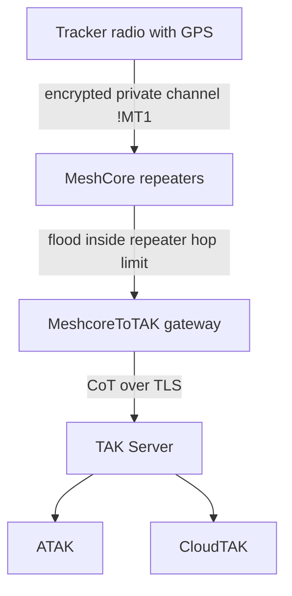
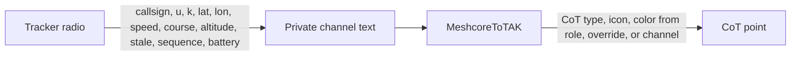
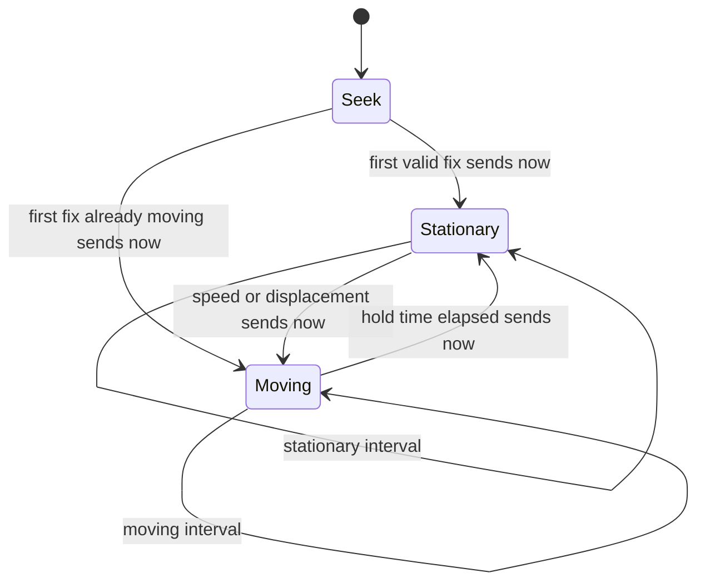

# MeshCoreTracker

GPS trackers on MeshCore radios. A tracker sends a short encrypted fix. [MeshcoreToTAK](https://github.com/CopIXus/MeshcoreToTAK) turns that into a Cursor-on-Target marker for a TAK Server. The radio does not send color, icon, or CoT type.

The LilyGO T-Beam (SX1262 and SX1276) is the first radio under test. The same `!MT1` message is what every later GPS board must speak. Live coordinates stay out of normal MeshCore adverts.

## System path

The fix is encrypted on the private MeshCore channel. Repeaters flood it inside the event network. MeshcoreToTAK publishes CoT over TLS. ATAK and CloudTAK only see the marker.



`CopIXus/MeshcoreToTAK` listens on the private channel, parses `!MT1`, and publishes the CoT point. This firmware's only job is to emit that message. A normal advert from the tracker does not carry the live fix.

## What each side owns

The packet stays small so a moving tracker does not flood icon paths through every repeater.



`CopIXus/MeshcoreToTAK` chooses the picture. A role key such as `k9`, `veh`, or `per` selects a style stored on the gateway. One private channel can carry a K9, a vehicle, and a person without three channel keys.

Example, after the MeshCore `CALLSIGN: ` prefix:

```text
K9-REX: !MT1;u=A1B2C3D4;k=k9;la=36.123456;ln=-82.123456;s=1.2;c=90;a=512;st=30;q=1042;b=87
```

`u` is the first 4 bytes of the radio's public key, as 8 hex characters. The TAK uid is `meshtracker-` plus that id, so renaming the radio does not create a second marker.

## Set up a radio

You do not type the tracker message. After the radio has a GPS fix, the firmware writes `!MT1` and sends it on one private channel. You set three things, and those three things are what show up in the message:

| Setting | What it becomes | Where to set it |
|---|---|---|
| Callsign | The name in front of the message: `HamptonFire_Halava352_F150: !MT1;...` | USB `name`, or the device name in the MeshCore Android app |
| Role | The `k=` field, such as `k=fw` | USB `role` only |
| Channel | Which private channel carries the fix | USB `channel`, or the channel list in the MeshCore Android app |

The role is not a color. MeshcoreToTAK paints the marker. These are the roles the gateway already knows:

| Role | Asset | Marker |
|---|---|---|
| `k9` | K9 | Blue |
| `veh` | Vehicle | Amber |
| `per` | Person | Green |
| `fw` | Fire | Red |
| `ems` | EMS | Orange |
| `cmd` | Command | Purple |

A different 2 to 4 character role still plots. It uses the channel's fallback style until that role is added on the gateway.

### MeshCore Android app

Pair over Bluetooth the same way as any companion radio. The PIN is on the radio's Bluetooth screen. A tracker build that has not been given another PIN uses `123456`.

The app can set:

- **Device name.** That name is the callsign on every fix.
- **Channels.** Add the same private channel, with the same key, that the gateway listens on. The tracker sends on slot 1 unless you point it somewhere else.
- **Radio preset.** It has to match the mesh. The US preset used with this gateway is 910.525 MHz, bandwidth 62.5, spreading factor 7, coding rate 5.

The app cannot set the role. There is no role field, and the custom sensor settings are not the tracker role. The app also cannot edit the `!MT1` text.

On a radio whose storage is already full, a name entered in the app can apply until the next reboot and then come back as the short public-key name. The USB `name` command is the one this firmware keeps. Channel keys entered in the app are kept, because they update the channel file the radio already has.

Leave advert location sharing off. The live fix goes out as `!MT1`. It does not go out inside the normal advert. The tracker firmware turns advert location off at boot.

### USB console

Connect the radio with a USB cable. Open a serial terminal at **115200** baud. This is the setup that does not depend on the phone app:

```text
name HamptonFire_Halava352_F150
role fw
status
```

`status` prints the callsign, the role, the radio preset, and which channel slot will carry the fix. A callsign much longer than 12 characters still works, as long as `CALLSIGN: ` plus the fix stays inside MeshCore's 160-character group text.

If the private channel is not on the radio yet, add it. The key is the same value pasted into the gateway. It is 32 or 64 hex characters, or base64. A `#hashtag` name with no key uses the MeshCore hashtag channel.

```text
channel 1 TNTAK 00112233445566778899aabbccddeeff
track 1
```

`track` only selects a slot that already has a key. Slot 1 is the default.

Other roles are the same command: `role k9`, `role veh`, `role per`, `role ems`, `role cmd`.

### Check it on the radio

Press the user button until the screen says **Tracker**. That page shows the role, the channel name, the 8-character id, and the last latitude and longitude that were sent. The callsign is the name on the top line. A long callsign is cut off at the edge of the display; `status` prints the full name.

A sent line on the USB console looks like this:

```text
sent slot 1 HamptonFire_Halava352_F150: !MT1;u=356B093E;k=fw;la=36.295065;ln=-82.199457;a=589;st=600;q=1791057685;b=94
```

`k=fw` is the whole style instruction. The gateway turns that into the red fire marker. Reboot the radio once and run `status` again. The callsign and role should be unchanged.

### On the gateway

In MeshcoreToTAK, turn tracker parsing on for that same private channel. Parsing stays off until the box is checked, including after a gateway update. One channel can carry every role. A per-id row can change the callsign or the picture for one `u` without touching the radio.

## Reporting

Motion uses speed and displacement, with a hold so a stop at a light does not immediately look parked. The first valid fix is sent immediately. Later fixes follow the interval. Tracker text is not TAK chat.



Defaults are 15 seconds while moving and 300 seconds while stopped. Both are settings, not a reflash. Stale time sent in the message is twice the current interval. Five seconds remains available for one or two assets. Application acknowledgements are off unless an operator turns them on, because an ack is another flood.

Invalid GPS does not emit `0,0`.

## Build

The shared core is in `tracker/`. It has no pins and no radio driver.

```text
pio test -e native
pio run -e Tbeam_SX1262_meshcore_tracker_ble
pio run -e Tbeam_SX1276_meshcore_tracker_ble
```

Those T-Beam environments compile the core for the test radios. They do not open the GPS or the LoRa radio. The firmware that runs on a LilyGO T-Beam is the companion tracker build in [MeshcoreToTAK](https://github.com/CopIXus/MeshcoreToTAK): `Tbeam_SX1276_meshcore_tracker` or `Tbeam_SX1262_meshcore_tracker`, chosen to match the radio chip on the board. Wiring another GPS board is described in [docs/PORTING.md](docs/PORTING.md).

## Gateway

On MeshcoreToTAK, enable tracker messages on the private channel that holds the same key as the radio. Leave ordinary chat off on that channel if it should carry fixes only. The role catalog maps `k9`, `veh`, `per`, `fw`, `ems`, and `cmd`. A per-id row can override one tracker. Parsing stays off until that channel box is checked, including after a firmware update.
