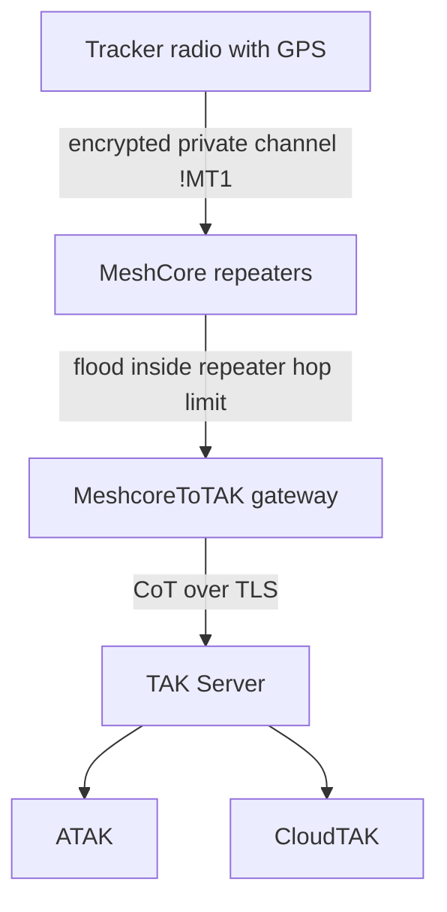
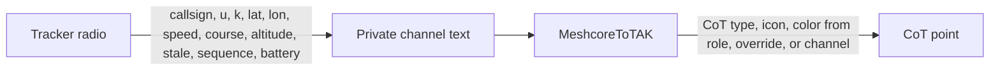
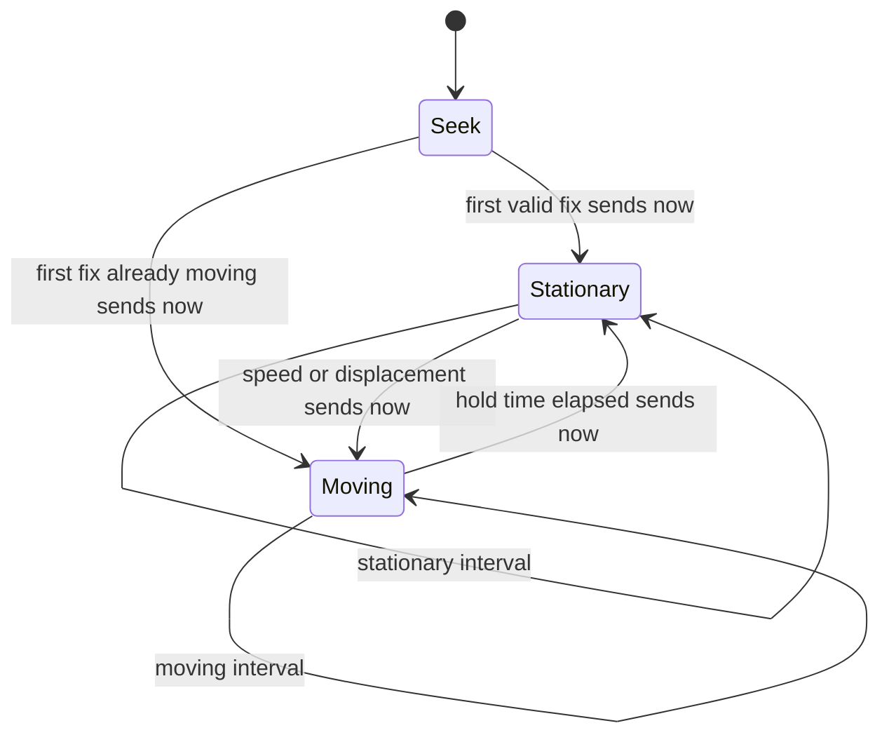

# MeshCoreTracker

GPS trackers on MeshCore radios. A tracker sends a short encrypted fix. [MeshcoreToTAK](https://github.com/CopIXus/MeshcoreToTAK) turns that into a Cursor-on-Target marker for a TAK Server. The radio does not send color, icon, or CoT type.

The LilyGO T-Beam (SX1262 and SX1276) is the first radio under test. The same `!MT1` message is what every later GPS board must speak. Live coordinates stay out of normal MeshCore adverts.

## System path

The fix is encrypted on the private MeshCore channel. Repeaters flood it inside the event network. MeshcoreToTAK publishes CoT over TLS. ATAK and CloudTAK only see the marker.



`CopIXus/MeshcoreToTAK` listens on the private channel, parses `!MT1`, and publishes the CoT point. This firmware's only job is to emit that message. A normal advert from the tracker does not carry the live fix.

## What each side owns

The packet stays small so a moving tracker does not flood icon paths through every repeater.



`CopIXus/MeshcoreToTAK` chooses the picture. A role key such as `k9`, `veh`, or `per` selects a style stored on the gateway. One private channel can carry a K9, a vehicle, and a person without three channel keys.

Example, after the MeshCore `CALLSIGN: ` prefix:

```text
K9-REX: !MT1;u=A1B2C3D4;k=k9;la=36.123456;ln=-82.123456;s=1.2;c=90;a=512;st=30;q=1042;b=87
```

`u` is the first 4 bytes of the radio's public key, as 8 hex characters. The TAK uid is `meshtracker-` plus that id, so renaming the radio does not create a second marker.

## Reporting

Motion uses speed and displacement, with a hold so a stop at a light does not immediately look parked. The first valid fix is sent immediately. Later fixes follow the interval. Tracker text is not TAK chat.



Defaults are 15 seconds while moving and 300 seconds while stopped. Both are settings, not a reflash. Stale time sent in the message is twice the current interval. Five seconds remains available for one or two assets. Application acknowledgements are off unless an operator turns them on, because an ack is another flood.

Invalid GPS does not emit `0,0`.

## Build

The shared core is in `tracker/`. It has no pins and no radio driver.

```text
pio test -e native
pio run -e Tbeam_SX1262_meshcore_tracker_ble
pio run -e Tbeam_SX1276_meshcore_tracker_ble
```

Those T-Beam environments compile the core for the test radios. They do not yet open the GPS UART or send LoRa. Wiring a board, including the T-Beam, is described in [docs/PORTING.md](docs/PORTING.md).

## Gateway

On MeshcoreToTAK, enable tracker messages on the private channel that holds the same key as the radio. Leave ordinary chat off on that channel if it should carry fixes only. The role catalog maps `k9`, `veh`, `per`, `fw`, `ems`, and `cmd`. A per-id row can override one tracker. Parsing stays off until that channel box is checked, including after a firmware update.
